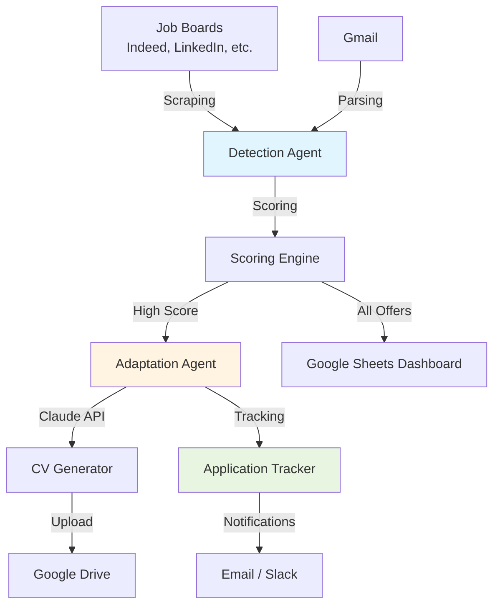

# 🤖 Job Search Agent

> Agent IA intelligent pour automatiser la recherche d'emploi, l'adaptation de CV et le suivi de candidatures.

[](https://github.com/pierrre2db/job-search-agent/actions/workflows/ci.yml)
[](https://www.python.org/downloads/)
[](https://opensource.org/licenses/MIT)
[](https://github.com/psf/black)

---

## 📋 Table des matières

- [Vue d'ensemble](#-vue-densemble)
- [Fonctionnalités](#-fonctionnalités)
- [Architecture](#-architecture)
- [Stack Technique](#-stack-technique)
- [Prérequis](#-prérequis)
- [Installation](#-installation)
- [Configuration](#-configuration)
- [Utilisation](#-utilisation)
- [Documentation](#-documentation)
- [Développement](#-développement)
- [Roadmap](#-roadmap)
- [Contribution](#-contribution)
- [License](#-license)

---

## 🎯 Vue d'ensemble

**Job Search Agent** est un système automatisé qui utilise l'IA (Claude d'Anthropic) pour :

1. **Détecter** les offres d'emploi pertinentes sur plusieurs plateformes
2. **Analyser** et scorer chaque offre selon vos critères personnels
3. **Adapter** automatiquement votre CV pour chaque poste
4. **Gérer** le suivi de vos candidatures et relances
5. **Archiver** tout dans Google Drive et Google Sheets

### 💡 Le problème résolu

La recherche d'emploi est chronophage :
- ❌ Scruter quotidiennement 10+ sites d'emploi
- ❌ Adapter manuellement son CV pour chaque poste
- ❌ Suivre ses candidatures dans des spreadsheets
- ❌ Oublier de relancer les recruteurs

### ✅ La solution

Un agent IA qui automatise 80% de ce travail répétitif, vous permettant de vous concentrer sur les entretiens et le networking.

---

## ✨ Fonctionnalités

### 🔍 Détection intelligente

- **Multi-source** : Indeed, LinkedIn, Pole Emploi, APEC, Welcome to the Jungle
- **Parsing avancé** : Emails Gmail, flux RSS, APIs officielles
- **Scoring intelligent** : Algorithme hybride (heuristique + IA sémantique)
- **Filtrage personnalisé** : Localisation, salaire, compétences, niveau

### 🎨 Adaptation automatique de CV

- **Analyse sémantique** : Claude identifie les compétences clés
- **Génération Word** : CVs adaptés en .docx professionnel
- **Portfolio linking** : Injection automatique de projets pertinents
- **A/B Testing** : Génération de variantes pour optimiser

### 📊 Suivi & Tracking

- **Dashboard Google Sheets** : Visualisation en temps réel
- **Statuts de candidature** : Détecté → Candidaté → Relancé → Entretien
- **Relances automatiques** : Emails de follow-up après X jours
- **Analytics** : Taux de réponse, conversion, insights

### 💾 Stockage centralisé

- **Google Drive** : Organisation automatique par entreprise/poste
- **Versioning** : Historique complet de vos CVs
- **Archivage** : Offres + CVs + metadata en JSON

---

## 🏗️ Architecture



### Modules principaux

| Module | Responsabilité | Technologies |
|--------|---------------|-------------|
| **Detection** | Scraping, parsing, scoring | BeautifulSoup, Selenium, Claude |
| **Adaptation** | Matching CV-offre, génération | Claude API, python-docx |
| **Tracking** | Suivi candidatures, relances | SQLAlchemy, FastAPI |
| **Storage** | Archivage, organisation | Google Drive API, Sheets API |
| **Portfolio** | Liens projets pertinents | Claude, GitHub API |

---

## 🛠️ Stack Technique

### Backend

- **Python 3.10+** : Langage principal
- **FastAPI** : API REST moderne et performante
- **Anthropic Claude** : IA pour matching sémantique
- **SQLAlchemy** : ORM pour base de données
- **Redis** : Caching et rate limiting

### Scraping & Parsing

- **BeautifulSoup4** : Parsing HTML
- **Selenium** : Scraping dynamique (JavaScript)
- **Gmail API** : Parsing emails d'offres

### Cloud & Storage

- **Google Drive API** : Stockage CVs et archives
- **Google Sheets API** : Dashboard temps réel
- **Google Cloud Platform** : Service accounts

### DevOps

- **Docker** : Containerisation
- **GitHub Actions** : CI/CD
- **pytest** : Tests unitaires et intégration
- **Black, flake8, mypy** : Qualité de code

---

## 📦 Prérequis

### Comptes requis

- ✅ [Google Cloud Platform](https://console.cloud.google.com) (gratuit)
- ✅ [Anthropic](https://console.anthropic.com) (payant à l'usage, ~3-5€/mois)
- ✅ GitHub account (pour le code)

### Logiciels

- Python 3.10 ou supérieur
- Git
- (Optionnel) Docker

---

## 🚀 Installation

### 1. Cloner le repository

```bash
git clone https://github.com/pierrre2db/job-search-agent.git
cd job-search-agent
```

### 2. Créer un environnement virtuel

```bash
python -m venv venv
source venv/bin/activate  # Sur Windows: venv\Scripts\activate
```

### 3. Installer les dépendances

```bash
pip install -r requirements.txt
```

### 4. Vérifier l'installation

```bash
python --version  # Python 3.10+
pip list | grep anthropic  # Vérifier les packages
```

---

## ⚙️ Configuration

### 1. Configuration des credentials

```bash
# Copier le template
cp config/credentials/api_keys.env.example config/credentials/api_keys.env

# Éditer et remplir vos clés
nano config/credentials/api_keys.env
```

**Clés requises :**
- `ANTHROPIC_API_KEY` : Votre clé Claude API
- `GOOGLE_DRIVE_CREDENTIALS_PATH` : Chemin vers le JSON Google Cloud
- `GOOGLE_SHEETS_ID` : ID de votre Google Sheet dashboard

### 2. Setup Google Cloud

Suivez le tutoriel détaillé : [`config/tutorials/setup_google_cloud.md`](config/tutorials/setup_google_cloud.md)

**Résumé :**
1. Créer un projet Google Cloud
2. Activer les APIs (Drive, Sheets, Gmail)
3. Créer un Service Account
4. Télécharger le fichier JSON credentials
5. Partager votre Drive/Sheets avec le service account

### 3. Setup Anthropic Claude

Suivez le tutoriel : [`config/tutorials/setup_anthropic.md`](config/tutorials/setup_anthropic.md)

**Résumé :**
1. Créer un compte sur https://console.anthropic.com
2. Ajouter un moyen de paiement
3. Générer une API key
4. Ajouter la clé dans `config/credentials/api_keys.env`

### 4. Personnaliser vos préférences

Éditez `config/settings/job_preferences.json` :

```json
{
  "job_search_criteria": {
    "target_roles": ["Python Developer", "Backend Engineer"],
    "locations": {
      "preferred": ["Paris", "Remote"]
    },
    "salary": {
      "minimum_annual": 45000,
      "target_annual": 60000
    }
  },
  "skills": {
    "technical": {
      "expert": ["Python", "FastAPI", "PostgreSQL"]
    }
  }
}
```

---

## 🎮 Utilisation

### Démarrer l'API

```bash
# En mode développement (avec hot-reload)
make run-dev

# Ou directement
uvicorn src.api.main:app --reload
```

L'API sera disponible sur : **http://localhost:8000**

### Endpoints principaux

```bash
# Health check
curl http://localhost:8000/health

# Traiter une nouvelle offre
curl -X POST "http://localhost:8000/process-offer?offer_url=https://indeed.fr/job/..."

# Lister les candidatures
curl http://localhost:8000/applications

# Détails d'une candidature
curl http://localhost:8000/applications/{id}
```

### Documentation interactive

Swagger UI : **http://localhost:8000/docs**

### Lancer les tests

```bash
# Tous les tests
make test

# Avec couverture
make test-coverage

# Tests unitaires uniquement
pytest tests/unit/ -v
```

---

## 📚 Documentation

### Guides complets

- 📖 [Guide de setup détaillé](docs/SETUP.md) *(à créer)*
- 🏗️ [Architecture système](docs/ARCHITECTURE.md) *(à créer)*
- 🔧 [Guide de développement](docs/DEVELOPMENT.md) *(à créer)*
- 🚀 [Guide de déploiement](docs/DEPLOYMENT.md) *(à créer)*
- 🐛 [Troubleshooting](docs/TROUBLESHOOTING.md) *(à créer)*

### Tutoriels configuration

- [Setup Google Cloud Platform](config/tutorials/setup_google_cloud.md) ✅
- [Setup Anthropic Claude API](config/tutorials/setup_anthropic.md) ✅
- [Setup Job Boards APIs](config/tutorials/setup_job_boards.md) ✅

### Fichiers de référence

- [Agile Todo Checklist](agile-todos-checklist.md) ✅
- [Starter Kit complet](job-search-agent-kit.md) ✅
- [Templates de code](templates-code.md) ✅

---

## 👨‍💻 Développement

### Workflow Git

```bash
# Créer une branche feature
git checkout -b feature/US-001-indeed-scraper

# Faire vos modifications
git add .
git commit -m "feat(detection): Add Indeed scraper with pagination"

# Pusher et créer une PR
git push origin feature/US-001-indeed-scraper
```

### Standards de code

```bash
# Formater le code
make format

# Vérifier le linting
make lint

# Lancer les tests
make test
```

### CI/CD

Le pipeline CI/CD s'exécute automatiquement sur chaque push :
- ✅ Linting (black, flake8, mypy)
- ✅ Tests (Python 3.10 et 3.11)
- ✅ Security scan (safety, bandit)
- ✅ Build check
- ✅ Docker build (sur main)

Voir : [`.github/workflows/ci.yml`](.github/workflows/ci.yml)

---

## 🗺️ Roadmap

### ✅ Phase 1 - MVP (Sprint 1-2) - *En cours*

- [x] Structure du projet et configuration
- [x] CI/CD pipeline
- [ ] Module Detection (scraping Indeed)
- [ ] Scoring engine (heuristique + Claude)
- [ ] Dashboard Google Sheets
- [ ] Module Adaptation (génération CV)

### 🔄 Phase 2 - Growth (Sprint 3-4)

- [ ] Application tracking
- [ ] Notifications et relances
- [ ] Multi-board support (LinkedIn, WTTJ, Apec)
- [ ] Portfolio linking automatique

### 🚀 Phase 3 - Scale (Sprint 5+)

- [ ] A/B testing de CVs
- [ ] ATS integration (Greenhouse, Lever)
- [ ] Analytics avancées
- [ ] Mode recruiter (vendre CVs)
- [ ] Career path prediction

Voir la roadmap complète : [agile-todos-checklist.md](agile-todos-checklist.md)

---

## 🤝 Contribution

Les contributions sont les bienvenues !

### Comment contribuer

1. **Fork** le projet
2. Créer une **branche feature** (`git checkout -b feature/AmazingFeature`)
3. **Commit** vos changements (`git commit -m 'feat: Add AmazingFeature'`)
4. **Push** vers la branche (`git push origin feature/AmazingFeature`)
5. Ouvrir une **Pull Request**

### Guidelines

- Suivre les conventions de commit ([Conventional Commits](https://www.conventionalcommits.org/))
- Ajouter des tests pour toute nouvelle fonctionnalité
- Maintenir la couverture de tests >80%
- Mettre à jour la documentation si nécessaire

Voir : [CONTRIBUTING.md](CONTRIBUTING.md) *(à créer)*

---

## 📊 Statistiques du projet

```bash
# Lignes de code
find src -name "*.py" | xargs wc -l

# Nombre de modules
find src/modules -type d -maxdepth 1

# Couverture des tests
pytest --cov=src tests/
```

---

## 🔒 Sécurité

- 🔐 Credentials **jamais** committés (`.gitignore` configuré)
- 🔑 Variables d'environnement pour secrets
- 🛡️ Security scans automatiques (Bandit, Safety)
- ✅ Dépendances régulièrement auditées

**Signaler une vulnérabilité :** Ouvrir une issue avec le label `security`

---

## 📄 License

Ce projet est sous license **MIT** - voir le fichier [LICENSE](LICENSE) pour plus de détails.

---

## 👤 Auteur

**Pierre** - [@pierrre2db](https://github.com/pierrre2db)

---

## 🙏 Remerciements

- [Anthropic](https://www.anthropic.com) pour Claude API
- [Google Cloud Platform](https://cloud.google.com) pour Drive/Sheets APIs
- La communauté Open Source Python

---

## 📞 Support

- 📧 Email : pierre2db@gmail.com
- 📱 Téléphone : 0499/45 54 45
- 🐛 Issues : [GitHub Issues](https://github.com/pierrre2db/job-search-agent/issues)
- 💬 Discussions : [GitHub Discussions](https://github.com/pierrre2db/job-search-agent/discussions)

---

<div align="center">

**⭐ Si ce projet vous aide, n'oubliez pas de lui donner une étoile !**

Made with ❤️ and 🤖 by Pierre

</div>
