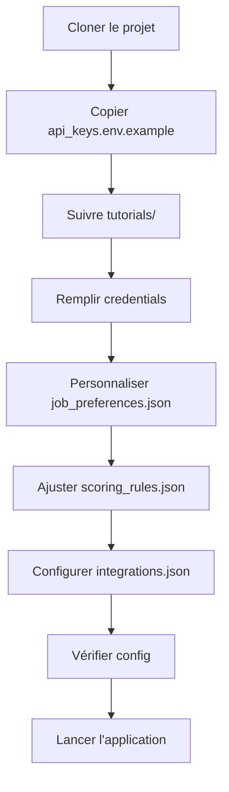

# Configuration - Job Search Agent

Ce répertoire centralise **toute la configuration** du projet Job Search Agent.

---

## 📁 Structure

```
config/
├── credentials/          # 🔐 Clés API et credentials (NE PAS COMMIT)
│   ├── .gitignore
│   ├── README.md
│   ├── api_keys.env.example
│   └── [vos fichiers credentials réels]
│
├── settings/            # ⚙️ Fichiers de configuration JSON
│   ├── claude_config.json
│   ├── job_preferences.json
│   ├── scoring_rules.json
│   └── integrations.json
│
├── tutorials/           # 📚 Guides de setup pas-à-pas
│   ├── setup_google_cloud.md
│   ├── setup_anthropic.md
│   └── setup_job_boards.md
│
└── README.md           # Ce fichier
```

---

## 🚀 Démarrage rapide

### Étape 1 : Credentials

1. **Copier le template**
   ```bash
   cp config/credentials/api_keys.env.example config/credentials/api_keys.env
   ```

2. **Remplir vos clés API**
   - Suivre les tutoriels dans `config/tutorials/`
   - Éditer `config/credentials/api_keys.env`

3. **Télécharger Google credentials**
   - Suivre `tutorials/setup_google_cloud.md`
   - Placer le fichier JSON dans `config/credentials/google_credentials.json`

### Étape 2 : Personnaliser les settings

1. **Profil candidat** → `settings/job_preferences.json`
   - Vos compétences
   - Vos préférences de poste
   - Vos critères de recherche

2. **Règles de scoring** → `settings/scoring_rules.json`
   - Ajuster les poids de scoring
   - Définir vos seuils de décision

3. **Intégrations** → `settings/integrations.json`
   - Activer/désactiver les services
   - Configurer les job boards
   - Paramétrer les planificateurs

### Étape 3 : Vérifier

```bash
# Tester que tout est bien configuré
python scripts/check_config.py
```

---

## 📋 Description des fichiers

### 🔐 credentials/

#### `api_keys.env`
Variables d'environnement pour toutes les clés API.

**Contient :**
- `ANTHROPIC_API_KEY` : Clé Claude
- `GOOGLE_SHEETS_ID` : ID de votre Google Sheet
- Clés des job boards (Indeed, LinkedIn, etc.)

#### `google_credentials.json`
Service Account Google Cloud pour accéder à Drive et Sheets.

**Comment l'obtenir :**
Voir `tutorials/setup_google_cloud.md`

---

### ⚙️ settings/

#### `claude_config.json`
Configuration de l'API Claude et des agents IA.

**Sections principales :**
- `claude_api` : Paramètres généraux (modèle, tokens, température)
- `agents` : Configuration de chaque agent (detection, adaptation, tracking, portfolio)
- `caching` : Paramètres de cache Redis
- `cost_optimization` : Optimisation des coûts API

**Exemple :**
```json
{
  "claude_api": {
    "model": "claude-sonnet-4-20250514",
    "max_tokens": 2000,
    "temperature": 0.7
  }
}
```

#### `job_preferences.json`
Votre profil de candidat et vos préférences de recherche.

**À personnaliser :**
- `candidate_profile` : Nom, email, portfolio, LinkedIn
- `job_search_criteria` : Rôles, localisations, salaire
- `skills` : Vos compétences techniques et soft skills
- `work_preferences` : Remote, culture, avantages

**Exemple :**
```json
{
  "job_search_criteria": {
    "target_roles": ["Python Developer", "Backend Engineer"],
    "locations": {
      "preferred": ["Paris", "Remote"]
    },
    "salary": {
      "minimum_annual": 45000,
      "target_annual": 60000
    }
  }
}
```

#### `scoring_rules.json`
Règles et algorithmes de scoring des offres d'emploi.

**Sections :**
- `scoring_components` : Poids de chaque critère (skills, location, salary, etc.)
- `bonus_malus` : Facteurs qui augmentent/diminuent le score
- `special_rules` : Deal-breakers et auto-boost
- `semantic_analysis` : Configuration de l'analyse sémantique

**Poids par défaut :**
```
Skills match      : 40%
Location match    : 20%
Salary match      : 15%
Seniority match   : 10%
Company culture   : 10%
Benefits          : 5%
```

#### `integrations.json`
Configuration de tous les services externes.

**Services configurables :**
- Google Drive : Structure de dossiers, nommage, versioning
- Google Sheets : Dashboard, colonnes, mise à jour auto
- Gmail : Détection d'emails, notifications
- Job Boards : Indeed, LinkedIn, Pole Emploi, etc.
- Redis : Caching, rate limiting
- Database : SQLite/PostgreSQL
- Webhooks : Slack, custom endpoints
- Scheduler : Jobs planifiés (scraping, relances, etc.)

---

### 📚 tutorials/

#### `setup_google_cloud.md`
Guide complet pour configurer Google Cloud Platform.

**Couvre :**
- Créer un projet GCP
- Activer les APIs (Drive, Sheets, Gmail)
- Créer un Service Account
- Télécharger les credentials
- Partager Drive avec le service account
- Tester la connexion

#### `setup_anthropic.md`
Guide pour créer un compte Anthropic et obtenir une clé API.

**Couvre :**
- Créer un compte
- Ajouter un moyen de paiement
- Générer une clé API
- Comprendre les coûts
- Optimiser l'usage
- Tester la connexion

#### `setup_job_boards.md`
Guide pour configurer les APIs des job boards.

**Couvre :**
- Indeed (scraping)
- LinkedIn Jobs API
- Pole Emploi API (France)
- Welcome to the Jungle
- Glassdoor
- Bonnes pratiques de scraping

---

## 🔒 Sécurité

### ⚠️ IMPORTANT

**Le dossier `credentials/` ne doit JAMAIS être commité sur Git !**

- Un `.gitignore` est déjà configuré
- Vérifiez avant chaque commit :
  ```bash
  git status
  # Ne doit PAS montrer de fichiers dans config/credentials/
  ```

### Bonnes pratiques

✅ **À faire :**
- Utiliser des variables d'environnement
- Révoquer immédiatement les clés compromises
- Utiliser des clés différentes pour dev/prod
- Ne jamais hardcoder les clés dans le code

❌ **À éviter :**
- Commit de fichiers credentials
- Partager les clés par email/Slack
- Utiliser la même clé partout
- Laisser les clés dans l'historique Git

---

## 🧪 Vérification de la configuration

Créer un script `scripts/check_config.py` :

```python
#!/usr/bin/env python3
import os
import json
from pathlib import Path

def check_config():
    """Vérifie que tous les fichiers de config sont présents et valides"""

    print("🔍 Vérification de la configuration...\n")

    # Vérifier credentials
    print("📋 Credentials:")
    api_keys = Path("config/credentials/api_keys.env")
    google_creds = Path("config/credentials/google_credentials.json")

    if api_keys.exists():
        print("  ✅ api_keys.env trouvé")
    else:
        print("  ❌ api_keys.env manquant")

    if google_creds.exists():
        print("  ✅ google_credentials.json trouvé")
    else:
        print("  ❌ google_credentials.json manquant")

    # Vérifier settings JSON
    print("\n📋 Settings:")
    settings_files = [
        "claude_config.json",
        "job_preferences.json",
        "scoring_rules.json",
        "integrations.json"
    ]

    for file in settings_files:
        path = Path(f"config/settings/{file}")
        if path.exists():
            try:
                with open(path) as f:
                    json.load(f)
                print(f"  ✅ {file} valide")
            except json.JSONDecodeError:
                print(f"  ❌ {file} invalide (JSON malformé)")
        else:
            print(f"  ❌ {file} manquant")

    print("\n✅ Vérification terminée!")

if __name__ == "__main__":
    check_config()
```

**Lancer la vérification :**
```bash
python scripts/check_config.py
```

---

## 📊 Workflow de configuration



---

## 🆘 Problèmes courants

### "Config file not found"
```bash
# Vérifier que les fichiers existent
ls -la config/credentials/
ls -la config/settings/

# Copier les templates si manquants
cp config/credentials/api_keys.env.example config/credentials/api_keys.env
```

### "JSON decode error"
```bash
# Valider vos fichiers JSON
python -m json.tool config/settings/claude_config.json
```

### "API key invalid"
- Vérifier qu'il n'y a pas d'espaces avant/après la clé
- Re-générer la clé
- Vérifier que le fichier `.env` est bien chargé

---

## 📚 Ressources

- [Pydantic Settings Docs](https://docs.pydantic.dev/latest/usage/settings/)
- [Python dotenv](https://pypi.org/project/python-dotenv/)
- [Google Cloud Python](https://cloud.google.com/python/docs/reference)
- [Anthropic API Docs](https://docs.anthropic.com)

---

## 🔄 Mise à jour de la configuration

Les fichiers de configuration peuvent évoluer. Pour rester à jour :

```bash
# Sauvegarder votre config actuelle
cp config/credentials/api_keys.env config/credentials/api_keys.env.backup

# Pull les dernières modifications
git pull origin main

# Comparer et fusionner
diff config/credentials/api_keys.env.example config/credentials/api_keys.env
```

---
